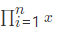

# Latex To HTML Parser  
As the name clearly indicates this is a parser that converts valid LaTeX to HTML code.

This is achieved by creating a parse tree of the entered LaTeX text and then the tree is
parsed and converted into valid HTML dom elements part of a single rooted dom node. This single 
node also uses the union of custom fonts to obtain all the symbols available in TeX as 
an SVG (so that the output is crystal clear on all displays).

These SVG fonts are stored across multiple files and their union is used to achieve 
the desired result.

__Author__: Anish Sachdeva (@anishLearnsToCode)


Distributed under the MIT Licence.

## Examples

### Using the Roman Family text
 ```latex
$\textrm{II}$
 ```

__Output__
````text
II
````

### Using the Sans Serif Family
```latex
$\textsf{II}$
```

__Output__
````text
||
````

Other series are as follows

| Series | Style |
|--------|-------|
| `\texttt{}` | TypeWriter |
| `\textmd{}` | Medium Series |
| `\textbf{}` | __Bold__ Series |


### Displaying superscript
```latex
$x^2$
```

__Output__ <br>
x<sup>2</sup>

### Using subscript
```latex
$x_{y}$
```

__Output__ <br>
x <sub>y</sub>


### Using Fractions
```latex
$\frac{x}{y}$
```

__Output__ <br>


### Using nth Square Root
```latex
\sqrt[n]{x}
```

__Output__ <br>


## Using Summation Symbol
```latex
$\sum_{i=1}^{n}  x$
```

__Output__ <br>


### Using Pi Product Symbol
```latex
$\prod_{i=1}^{n}  x$
```

__Output__ <br>


### Other Math Mode Symbols
| Symbol | Output |
|-------:|:------:|
| `\leq` | &leq; |
| `\times` | &times; |
| `\geq` | &geq; |
| `\neq` | &ne; |
| `\approx` | &approx; |
| `\div` | &div; |
| `\pm` | &pm; |
| `\cdot` | . |
| `^{\circ}` | <sup>&cir;</sup> |
| `\prime` | `|
| `\primecdots` | ... |
| `\infty` | &infin; |
| `\neg` | - |
| `\wedge` | &and; |
| `\vee` | &or; |
| `\supset` | &sup; |
| `\forall` | &forall; |
